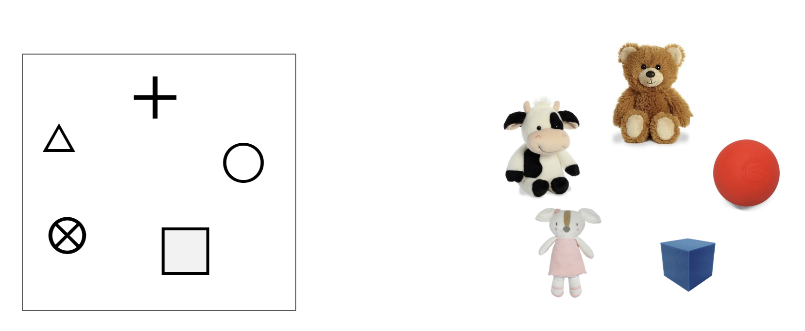

# 3: Features and Symbols

[Click here to see the comic strip as a slideshow!](https://docs.google.com/presentation/d/e/2PACX-1vRGqAXpYEl5zJTf-AdlMN41Xj8TmhBFZNFuua8ggYhrg-39EgZaqQZoRyhDlxP17w/pub?start=false\&loop=false\&delayms=3000)

.png>)

[**Click here to see the comic strip as a slide show!**](https://docs.google.com/presentation/d/e/2PACX-1vTdj0BrOX8jyGrx1-3wFIkVTuPdjMQ1jFja-T\_9cwmFFsraFYQyOGbE\_lP3krdGhA/pub?start=false\&loop=false\&delayms=10000)****

### **Introduction**

"This time we will create **symbols** for our objects. We'll use the **symbols** to know which object to find, and we'll draw our first **map** of the objects."

### **Learning Goals**

* Use symbols to represent objects
* Arrange objects to match a map
* Create a map to show the relationships of objects
* Vocabulary
  * **Map**: A drawing that shows places and objects
  * **Feature**: (In orienteering) An object that can be represented on a map
  * **Symbol**: (In orienteering) A shape or image used to represent features on a map
  * **Key**: A list of symbols and what they mean

### **Materials**

* 5 Objects: Each object should be unique and small enough to arrange on a table.
* 3 or more sheets of paper
* Pencil
* A Partner

### **Safety**

In this activity, you will by working with paper and pencil. Don't get a paper cut!

Pay attention when moving through the space so you don't hurt yourself or break anything.

### **Games**

* **Set up**
  * Before playing these games, you must first create a **symbol** for each of your objects. Indicate which symbol matches each object. This list of symbols is your **key**.
  * The **symbols** we are using are shown below. **** You may use these **symbols** if you like, or create your own.

* Game 1: **Feature Tag**
  * Place the objects around your space.
  * Draw the five **symbols** on a piece of paper (separate from your **key**). One person points to a **symbol** on the paper, and the other must run to the matching object in the space. Participants may refer to the **key** if they forget which object matches each **symbol**.
  * Switch roles and play again until both people have visited all **symbols** and can identify each **symbol** without using the **key**.
* Game 2: **Tabletop Maps - Part I**
  * Bring your objects to a table, along with the paper and pencil.
  * On the paper, one person draws the **symbols** in any arrangement. This drawing is your **map**.
  * The other person places to objects to match the arrangement of **symbols** shown on the **map**.
  * Switch roles and play again.
  * _Here is an example_:

* Game 3: **Tabletop Maps - Part II**
  * This game is similar to Part I, but played in reverse. One person arranges the objects on the table in any way. When finished, the other person draws a **map** on the paper using the **symbols** for each object.
  * Switch roles and play again.

### **Reflection**

1. In **Feature Tag**, did you always go to the right object?&#x20;
2. Outside of this game, how do you remember where to find things you need? Do you ever forget where things are? Do you have ways to make it easier to remember where things are?
3. In **Tabletop Maps**, was it easier to draw the map of the objects, or place the objects to match the map?&#x20;
4. What was hard about arranging the objects? How could you tell when the objects and the map matched correctly?
5. How did you remember which objects matched with each symbol?
6. Do you use symbols at school or in other games?

### **Do More**

**Tabletop Maps**: With the objects on the table and a corresponding **map**, have one person hide a small object (scrap of paper, coin, etc.) underneath one of the objects, and mark its location on the **map**. The other person has one chance to find the object using the **map**. If they find the object, switch roles and play again. If they guess incorrectly, the hider reveals the object, and gets to hide it again.

**Tabletop Maps**: Try spreading out to a larger space on the floor and put the objects farther apart. Are the games harder when the objects are no longer close together?&#x20;
