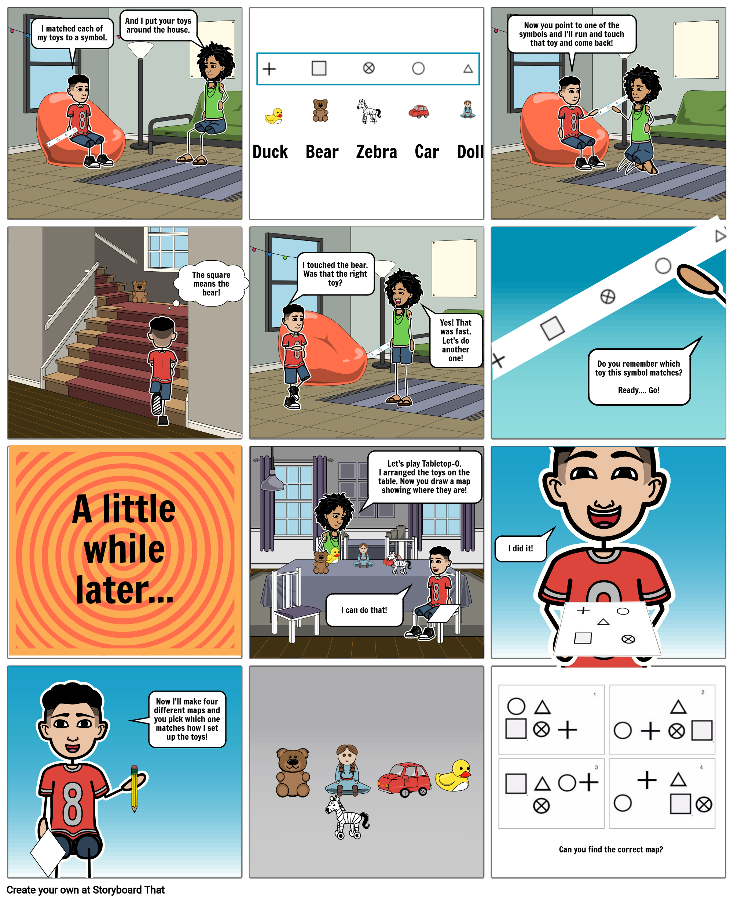

# 2: Features and Symbols

### **Comic Strip**

\*\*\*\*[**Click here to see the comic strip as a slide show!**](https://docs.google.com/presentation/d/e/2PACX-1vTdj0BrOX8jyGrx1-3wFIkVTuPdjMQ1jFja-T_9cwmFFsraFYQyOGbE_lP3krdGhA/pub?start=false&loop=false&delayms=10000)\*\*\*\*

[**Click here to see the comic strip as a slide show!**](https://docs.google.com/presentation/d/e/2PACX-1vTdj0BrOX8jyGrx1-3wFIkVTuPdjMQ1jFja-T_9cwmFFsraFYQyOGbE_lP3krdGhA/pub?start=false&loop=false&delayms=10000)\*\*\*\*

### **Learning Goals**

* Use symbols to represent objects
* Arrange objects to match a map
* Create a map to show the relationships of objects
* Vocabulary
  * **Map**: a drawing that shows places and objects
  * **Feature**: in orienteering, an object that can be represented on a map
  * **Symbol**: A shape used on a map to represent a feature
  * **Key**: a list of symbols and what they mean

### **Materials**

* 5 Objects, small enough that you can arrange all of them on a table.
* 3 or more sheets of paper
* Pencil

### **Safety**

In this activity, you will by working with paper and pencil. Don't get a paper cut!

Be careful when moving through your space.

### **Games**

**Set up**

For this game, we will use five symbols, one for each object. Here are our five symbols: 

Now, you decide which symbol will represent each of your five objects.

For example, I am using the five objects shown below. The bear is represented by a + sign, the circle means the ball, and so on.

With your paper and pencil, make a key to show which symbol means which of your objects. Here is my key:

**Game 1: Feature Tag**

1. Place the objects around your space.
2. Draw the five symbols on a piece of paper. When your partner points to a symbol, run or walk to the object represented by that symbol, tag the object, and come back.

**Game 2: Tabletop Maps**

Bring your objects to a table, along with the sheets of paper and pencil.

Here is a map. Can you arrange your objects on the table to match the map?

Here's how we did it:

With a partner, take turns drawing maps and placing the objects to match the map.

Then, place the objects first and then draw a map showing how they are arranged.

### **Reflection**

1. In **Feature Tag**, did you always go to the right object? 
2. In **Tabletop Maps**, was it easier to draw the map of the objects, or place the objects to match the map? 
3. What was hard about arranging the objects? How could you tell when the objects and the map matched correctly?
4. How did you remember which objects matched with each symbol?

### **Do More**

With the objects arranged on the table and a corresponding map, have your partner hide a small object \(scrap of paper, coin, etc.\) underneath one of the objects, and mark the corresponding location on the map. Can you find the hidden object right away? Then, switch. 

Try spreading out to a larger space on the floor and put the objects farther apart. Make a map of them. Is it harder when the objects are farther apart? 

