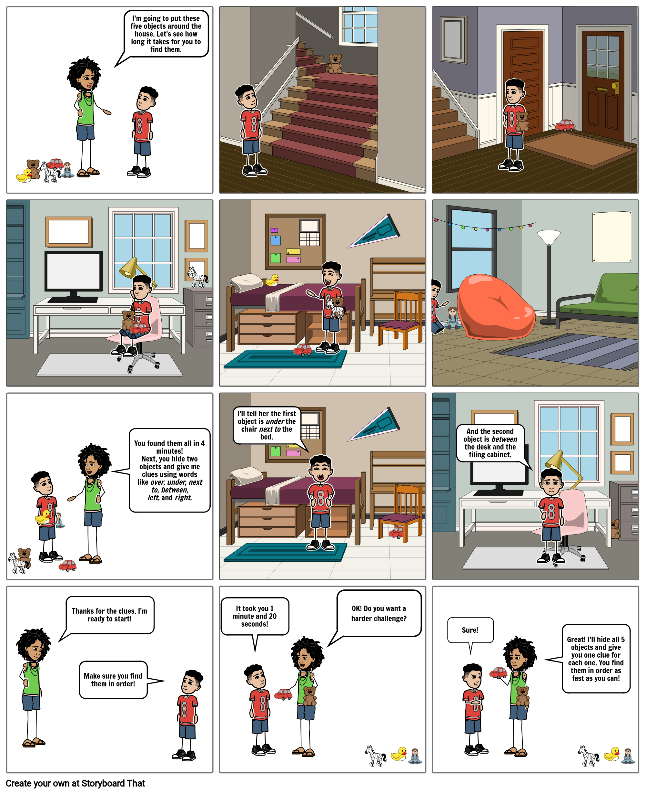

# 1: Find Five and Clues

[Click here to see the comic strip as a slideshow!](https://docs.google.com/presentation/d/e/2PACX-1vQT1O77fIcoe_69fhR2oOAE3xgFYCCRkHG_zBMooFgFRW416Da4RTRAM_17r6u2RjSfuMAXtcl5X_6V/pub?start=true&loop=false&delayms=5000&slide=id.p1)

[To view the comic strip as a slideshow, click here!](https://docs.google.com/presentation/d/e/2PACX-1vQT1O77fIcoe_69fhR2oOAE3xgFYCCRkHG_zBMooFgFRW416Da4RTRAM_17r6u2RjSfuMAXtcl5X_6V/pub?start=true&loop=false&delayms=5000)

###  **Introduction** 

"Today we will play with a partner to find hidden objects using clues."

### **Learning Goals**

* Paying attention to surroundings
* Spatial memory
* Spatial vocabulary
  * **Closer/Farther**
  * **Left/Right**
  * **Above/Below**
  * **In Front/Behind**
  * **Beside/Between**
* Orienteering vocabulary
  * **Course Setter**: the person who hides the objects
  * **Orienteer**: the person who finds the objects

### Materials

* Five objects for hiding: These may be as large as stuffed animals, as small as coins, or any combination. \(You should be able to carry all five objects at once, to make hiding them easier.\)
* A partner

### Safety

Do not place objects in unsafe places.  

Pay attention when moving through the space so you don't hurt yourself or break anything.

### The Games

* Game 1: **Find Five**
  * Designate one person to be the **Course Setter** and the other to be the **Orienteer**. The **Orienteer** closes their eyes while the **Course Setter** places the five objects in plain sight throughout the space. Once the objects are hidden, the **Orienteer** opens their eyes and searches for the objects.
  * Switch roles and play again.
* Game 2: **Clues**
  * Have the **Course Setter** place just TWO objects in new locations. This time the objects can be harder to find. The **Course Setter** gives two clues, one for each object. The clues should use spatial vocabulary such as: _above, below, left, right, next to, in front, behind, far, near, on top, underneath_, etc. The **Orienteer** uses these clues to find the two objects.
  * Switch roles and play again. Continue to switch back and forth, increasing the number of objects hidden each time until both people can remember clues for all five objects at once.

### Reflection

1. What strategies did you use to find the objects in the **Find Five**, when you had no clues?
2. Were you faster at finding objects in the **Clues** game?
3. Which objects were easier to find, and why?
4. Which locations were hardest to remember?
5. What strategies did you use to remember the clues?
6. How many clues could you remember easily?
7. Do you prefer being the **Course Setter** or the **Orienteer**?

### Do More

* **Find Five**: The **Course Setter** provides clues to the location of each object as the **Orienteer** is looking. For example, the **Course Setter** might say "warmer" or "colder" depending on whether the **Orienteer** is getting closer or farther from one of the objects.
* **Clues**: The **Orienteer** must find the objects in the same order in which they were described by the **Course Setter**.
* **Clues**: The **Course Setter** describes a location using words, and the **Orienteer** places an object in that location. The **Course Setter** confirms whether or not the location is correct.

