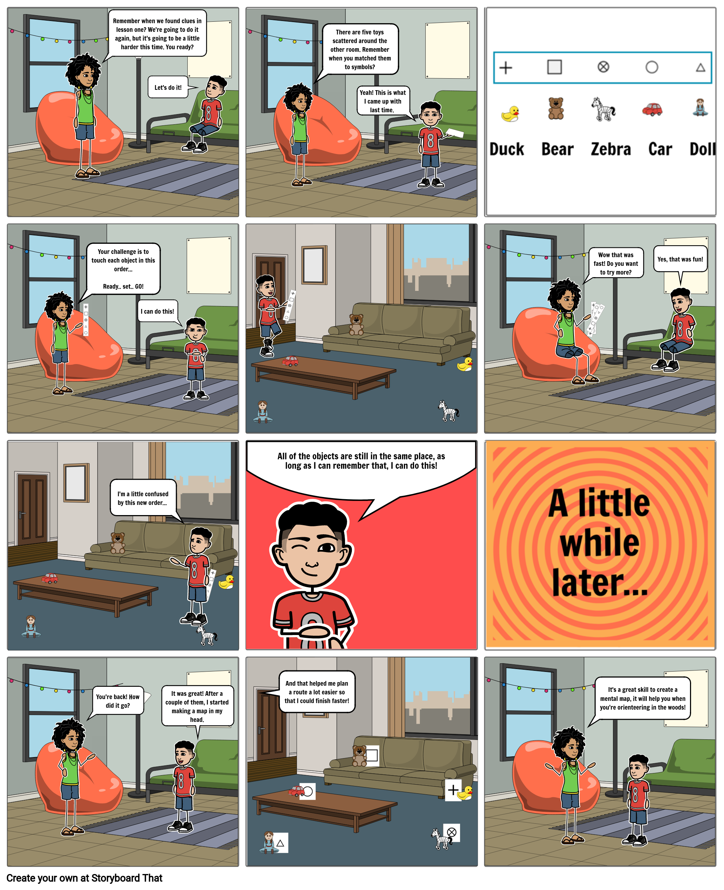

# 3: Clue Sheet Orienteering

[Click here to see the comic strip as a slideshow!](https://docs.google.com/presentation/d/e/2PACX-1vRGqAXpYEl5zJTf-AdlMN41Xj8TmhBFZNFuua8ggYhrg-39EgZaqQZoRyhDlxP17w/pub?start=false&loop=false&delayms=3000)

### **Learning Goals**

* Following a sequence
* Symbols
* Spatial Memory
* Vocabulary
  * **Route**: the path you take to get to all the objects
  * **Course**: a set of objects to visit in order, along with a start and finish location
  * **Clue sheet**: a list of symbols telling you which objects to visit, and in what order
  * **Checkpoint**: A landmark or significant location in the space

### **Materials**

* 5 Objects: These should be easy to see, approximately the size of a stuffed animal or larger.
* Paper
* Pencil
* Scissors

### Safety

Don't run with scissors. Learn the right way to hand scissors to another person \(hint: the sharp end points toward you, not them!\). 

What are the rules for moving around in your space? Are you allowed to run? If not, then walk!

Be careful to avoid objects and obstacles in the space. Agility is the ability to move quickly and easily, especially in a place where footing is uneven or there are obstacles. Be agile! Be nimble!

### Activity

#### Set Up

Identify 5 unique objects in the space. These can be anything from a table or TV to a stuffed animal or a plate of cookies.

Draw or write down the name of each object and its corresponding symbol. The symbol does not have to resemble the object.

On a separate sheet of paper, create several lists of 5 symbols—similar to the example below—and cut out each list into individual strips of paper. These are your "clue sheets".

#### Game: Clue Sheet Orienteering

For each course, the objective is to touch the objects corresponding to each symbol in the order they are shown. Do this for all courses.

### Reflection

* Did the activity get easier over time? Why might this be?
* Were some courses easier than others?
* Without looking, can you describe where each object is?

### Do More

Try moving around some of the objects between each round. How does the game grow more difficult as the number of objects moved increases? Are there any objects whose symbol or location is harder to remember?

Have someone else place the objects, so that you have to find them first before you can tag them. Do several courses with objects in this new location. What is it like to build up a map in your mind of where the objects are?

This activity can be done outdoors by assigning symbols to tables, benches, trees, and other objects. 

