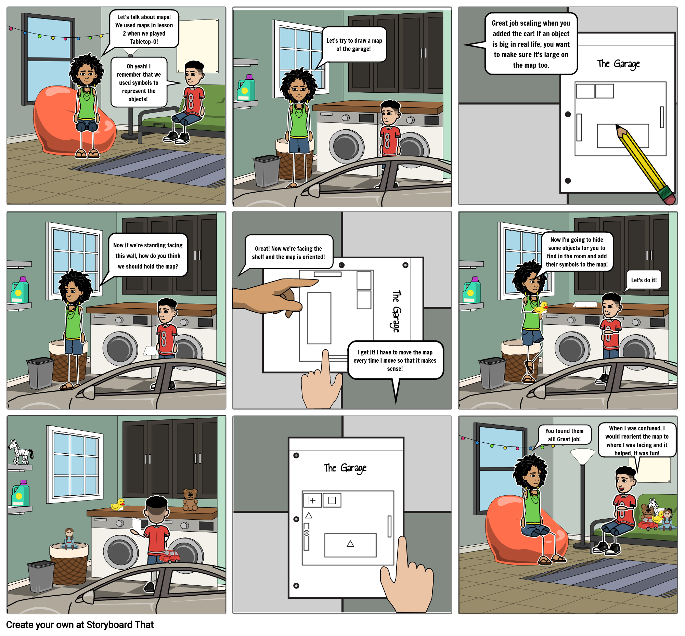

# 4: Make a Map

[Click here to see the comic strip as a slideshow!](https://docs.google.com/presentation/d/e/2PACX-1vQEqGBoSF-sAH8hKZMkuwt9KO7IzVAiBWHzprQMySm-LGwJ9ZHrir4Eo5kBa2xylg/pub?start=false&loop=false&delayms=3000)

### Learning Goals

* Vocabulary 
  * **Orientation \(Orient\)**: Rotating the map until it is aligned \(matched up\) with the space
  * **Scale**: The size of something on a map compared to real life

### **Materials**

* 5 Objects, around the size of a stuffed animal
* Paper
* Pencil with eraser
* Pen

### Safety

Be agile when moving around the space, and don't hurt yourself or bump into anything.

### Activity

#### Set Up: Draw a Map

Sketch a map of your space in pencil. If you are indoors, this could be a single room. Draw the map as though you are looking down from the ceiling.

Start with an outline of the boundary. For example, most rooms are rectangular. Once the outline is drawn, look around for the largest objects in the space \(tables, couches, doors, etc.\). Assign a symbol to each object, then place it on the map. Pay attention to the scale of the objects. For example, if there is a couch in the room that goes halfway along a wall, then draw it on the map so that it takes up the same amount of space.

After finishing the map in pencil, draw over it in pen.

#### Game 1: Orienting the Map

1. Walk around the space, and stop in different places. Each time you stop, rotate the map so that it matches up with where objects are in real life. Do this for several places within your space. This is called "orienting the map".
2. Stand in the middle of the space, facing one of the walls. Orient your map to the space, then turn to face a different wall. Orient your map again, and repeat for each wall in the space.

#### Game 2: Map Find Five

1. Place the five objects around the space. Draw a circle with your pencil on the map at each of the five places where you put an object.
2. Pass the map to someone else, and have them collect the objects. Each time they find an object, they draw a line in pencil through the circle. 
3. Erase the circles and lines. Switch roles, so the person finding the objects is now placing them and marking them on the map for the other person to find.

### Reflection

What was challenging about drawing the map? Were some objects harder to include than others?

How could you tell if the map was oriented to the space?

Was the other person able to effectively use your map? What parts of your map were confusing to them, and what parts were clear?

### Do More

Try redrawing the map of the room, but this time from different perspectives \(angles\). Which perspectives are easiest to understand? Which are easiest to draw? Which do you think is the best perspective?

