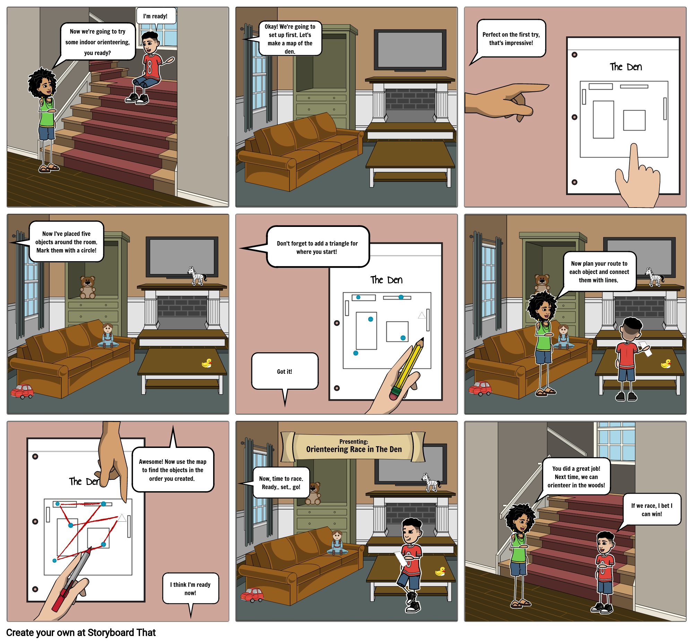

# 5: Indoor Courses

[Click here to see the comic strip as a slideshow!](https://docs.google.com/presentation/d/e/2PACX-1vTn6C3J-dCwibEtSeZrKcGcIG6Ui_6w1LmjptZ8uq52iU6kqHipxmobQ88tlRHXKlwLaay5yVBFIF5m/pub?start=false&loop=false&delayms=10000&slide=id.p1)

### Learning Goals

* Orientation
* Map Reading
* Identify alternate routes between controls; choose routes that work best; consider flow through controls.
* Vocabulary
  * **Start Triangle**: A triangle drawn on the map to show the location of the Start
  * **Control Circle**: A circle drawn on the map to show the location of a checkpoint or object that you need to visit.
  * **Route Choice**: Deciding which path \(route\) to get from once place to another
  * **Flow through a control**: it is often easier to move through a control location if you can leave in a different direction than you approached

### **Materials**

* 5 Objects, around the size of a stuffed animal
* Paper
* Pencil

### Safety

Follow the rules for moving around in the space. Walk if you are not allowed to run. Be agile so you avoid hurting yourself or bumping into things.

### Activity

#### Set Up

Create a map of the space. You can use one room or several rooms. If you want, you can use your map from the previous lesson, and it's also OK to have someone else make the map for you. Remember to sketch your map starting with an outline of the whole space. Then fill in the map with details of objects in the space, starting with the biggest ones. For the best results, draw the map as though you were looking straight down from the ceiling. 

Place your five objects throughout the space. They do not have to be hidden. Draw a circle on the map that corresponds to the location for each object.

Make several copies of your map by tracing it onto a new sheet of paper, or using a copier or scanner/printer if you have access to one.

On each map, choose a starting point and mark it with a triangle. Each map could have a different start.

Next, draw straight lines to connect all the circles. Each map should have the circles connected in a different order. These are your courses. The straight lines between circles are there to help guide your eye from one control to the next; you do not have to follow a straight line when you do the course!

#### Game: Indoor Orienteering

Run or walk each course, starting and finishing at the triangle. Time yourself as you go. Pay attention to the path you take to get to each checkpoint on the course. Keep your map oriented.

**Game: Freeze Orienteering**

Do the courses again, and have a partner call "FREEZE!" at a random moment while you are orienteering. Freeze. Have your partner check whether your map is correctly oriented. Remember that an oriented map is turned so it matches the space, and it's important to keep your map oriented while you do a course.

**Game: Obstacle Orienteering**

Create obstacles by moving furniture or placing large objects to block direct paths to each checkpoint. Now you must decide whether to go left or right around the obstacle. This is called **route choice**.

How do these changes affect your decision-making for each course? Now you are having to make **route choice** decisions! Sometimes an orienteer will choose a slightly longer route if it means they can **flow** more easily through a control -- for example, by not having to stop and go back the way they came, but instead keep moving forward.

### Reflection

On which courses were you fastest? Why?

Was it easy for you to keep your map oriented? What helps you keep it oriented? Is it easier to navigate and know which control to go to next, if your map is oriented?

How did you see which routes were available and decide which route to take?

### Do More

Have a partner create courses for you, and place the objects at each control circle. When you get back from your course, tell them which objects were at each control, so that they can check that you went to the right places.

Swap and do it for them. Now you are the course setter, and they are the orienteer.

