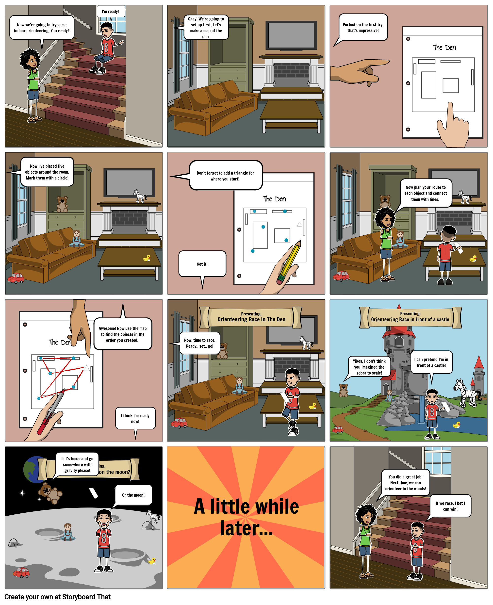

# 5: Indoor Courses

[Click here to see the comic strip as a slideshow!](https://docs.google.com/presentation/d/e/2PACX-1vTn6C3J-dCwibEtSeZrKcGcIG6Ui_6w1LmjptZ8uq52iU6kqHipxmobQ88tlRHXKlwLaay5yVBFIF5m/pub?start=false&loop=false&delayms=10000&slide=id.p1)

### Introduction

"Today we will use maps with **start triangles** and checkpoints to orienteer. We will also use obstacles to find the best **route** for each **course**."

### Learning Goals

* Orientation
* Map Reading
* Identify alternate routes between controls; choose routes that work best
* Vocabulary
  * **Route**: the path you take to get to all the objects
  * **Course**: a set of objects to visit in order, along with a start and finish location
  * **Start Triangle**: A triangle drawn on the map to show the location of the Start

### **Materials**

* 5 Objects: These should be easy to see, approximately the size of a stuffed animal or larger.
* Paper
* Pencil

### Safety

Pay attention when moving through the space so you don't hurt yourself or break anything.

### Activity

* **Set Up**

  * Draw a map of the space. \(You may use your map from previous lessons, or have someone make the map for you.\) Remember to start with an outline of the whole space, then fill in the map objects from largest to smallest. For the best results, draw the map as though you were looking straight down from the ceiling. 
  * Make several copies of your map by tracing it onto a new sheet of paper, or using a copier or scanner/printer if you have access to one.
  * Place your five objects throughout the space. They do not have to be hidden. Draw a circle on the map matching the location of each object. 
  * On each map, choose a starting location and mark it with a **start triangle**. The **start triangle** can be different for each map.
  * Create **courses** by drawing straight lines to connect the circles. Each circle should be used only once, and each map should connect the circles in a different order.

* Game 1: **Indoor Orienteering**

  * Run or walk each **course**, starting and finishing at the triangle. Time yourself as you go, and pay attention to the path \(aka the **route**\) you take to get to each checkpoint on the **course**. Keep your map oriented as you move!
  * Repeat the **courses**, but try taking different **routes** to each checkpoint if you can. Do the new **routes** affect your time?

  \*\*\*\*

* Game 2: **Obstacle Orienteering**
  * Create obstacles by moving furniture or placing large objects to block easy paths to each checkpoint. Now you must decide whether to go left, right, over, or under each obstacle. Is it sometimes faster to take a longer **route** around an obstacle rather than climbing over them?

### Reflection

1. On which **courses** were you fastest? Why?
2. Was it easy for you to keep your map oriented? What helps you keep it oriented? Is it easier to navigate and know which control to go to next if your map is oriented?
3. How did you see which **routes** were available and decide which **route** to take?

### Do More

Have a partner create **courses** for you, and place the objects at each control circle. When you get back from your **course**, tell them which objects were at each control, so they can check that you went to the right places.

